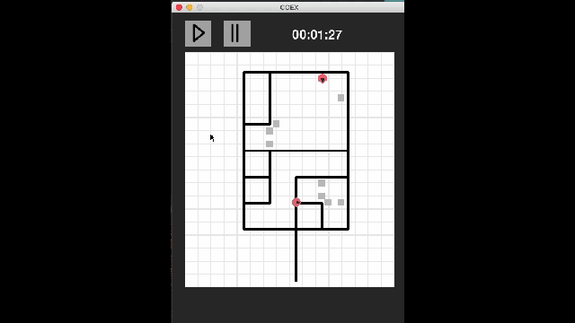

# Multi-robot environment mapping 

The goal of this project was to construct two robots, mapping unknown environments as quickly as possible. The considered environments are exclusively composed of straight paths, intersecting each other with right angles, and modelled by black lines on a white background. Furthermore, the robots are only allowed to move along those black lines during the exploration.

The developed solution follows a master-slave architecture. Each robot (slave) follows a black line while keeping track of the travelled distance. The robot stops once an intersection detected, and sends an information message to the master. The information contains the type of intersection encountered and the travelled distance since the previous intersection. This is then used by a program (master), running locally on a computer, to update its internal representation of the environment (i.e. map). The next instruction (stop, straight, turn left or right, uturn) for the robot is then computed and send. This procedure is repeated until the entire environment is detected.

    &nbsp;&nbsp;&nbsp;
    

The left-part of the animation above shows a live screen recording of the master constructing the map, corresponding to the exploration performed displayed in the right-part. A video of the complete demonstration can be found [here](https://www.youtube.com/watch?v=w8zaz-Xr6bw&t=6s). The implementation and results are described in the [report](https://awerenne.github.io/files/pp-report.pdf).

## Simulator
Debugging the mapping algorithm with the exploration being performed by physical robots, would have been costly in time. Instead, the master was first tested in a simulator. The latter emulating random environments and robots. 

    

The algorithm of the master is explained in the [report](report/personal-project.pdf)) (pages 8-11). A simulation can be lauched with <code>python main.py</code> in the folder *code/simulator/*. The flag <code>is_simulation</code> needs to be set to true in the config file.

## Robot
To make the robot robust a first challenge was to enable it to follow a curved line at constant speed. To this end, a speed and steering controller were developed (described in the [report](report/personal-project.pdf), pages 20-24). The result is shown below.

    

Thereupon, the robot was further designed to loop through a serie of steps during the exploration. The high-level view of the main algorithm (serie of steps) is implemented in the file *code/robot/mapping/mapping.ino*, which is based on low-level features implemented in the files located in the folder *code/robot/NewCOEX/*, where COEX stands for cooperative explorer. 

    

## Usage
The physical exploration and mapping process can be executed as follows:
1. Copy the folder *code/robot/NewCoex* in your Arduino folder, and load it as a library (explanations on how to load a library: [here](https://www.arduino.cc/en/guide/libraries)).
2. Install the library corresponding to the QTR-X sensors, as explained [here](https://www.pololu.com/docs/0J19/2).
3. Upload the program *code/robot/mapping/mapping.ino* to the micro-controller.
4. Verify in the config file that <code>is_simulation: False</code>, and that the ports correspond to the names of the used bluetooth modules.
5. Switch the power of the robots on, and calibrate the line sensors.
6. Launch the exploration with <code>python main.py</code> in *code/master/* .

