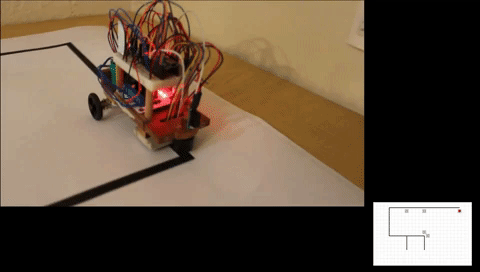

# Multi-robot environment mapping #

Video demonstrations of the robot can be found [here](https://drive.google.com/drive/folders/1HpFp8uEg_BgUqBJgKD_jaGhf2cml2gzG?usp=sharing).

#### TEST ####
gif demo

    

#### TODO ####
    * Readme
    * Add final demo video of two robots
    * Add gifs of demo as [here](https://medium.com/@josephcardillo/how-to-add-gifs-to-your-github-readme-89c74da2ce47)