# Steps of construction #

1. A chassis is cut from wood and used as a base. Additionally, four small
pillars are pasted at the corners.

    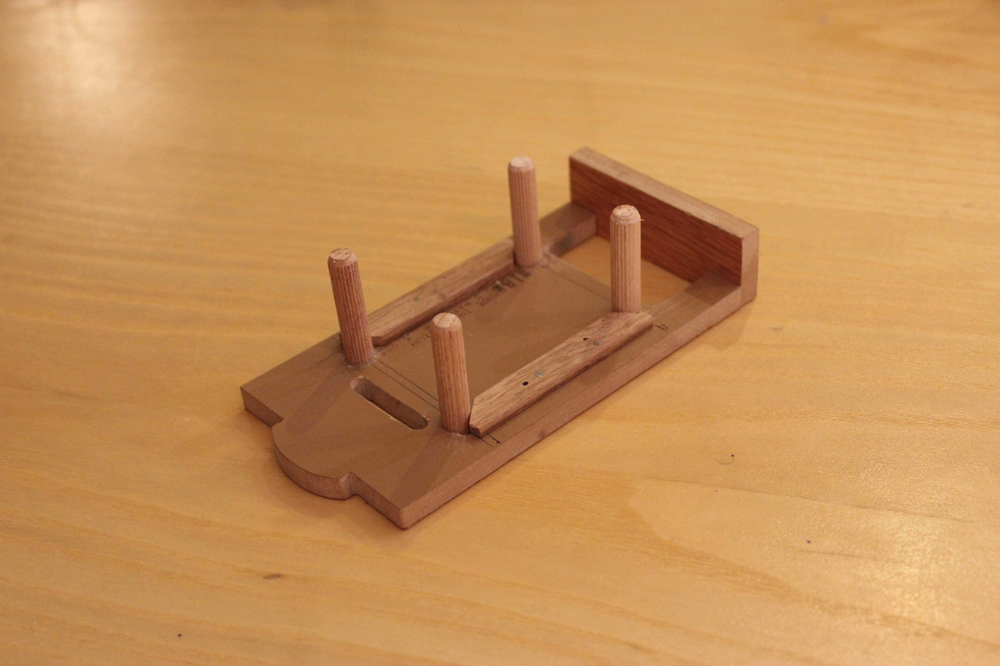

2. A breadboard is pasted on the pillars.

    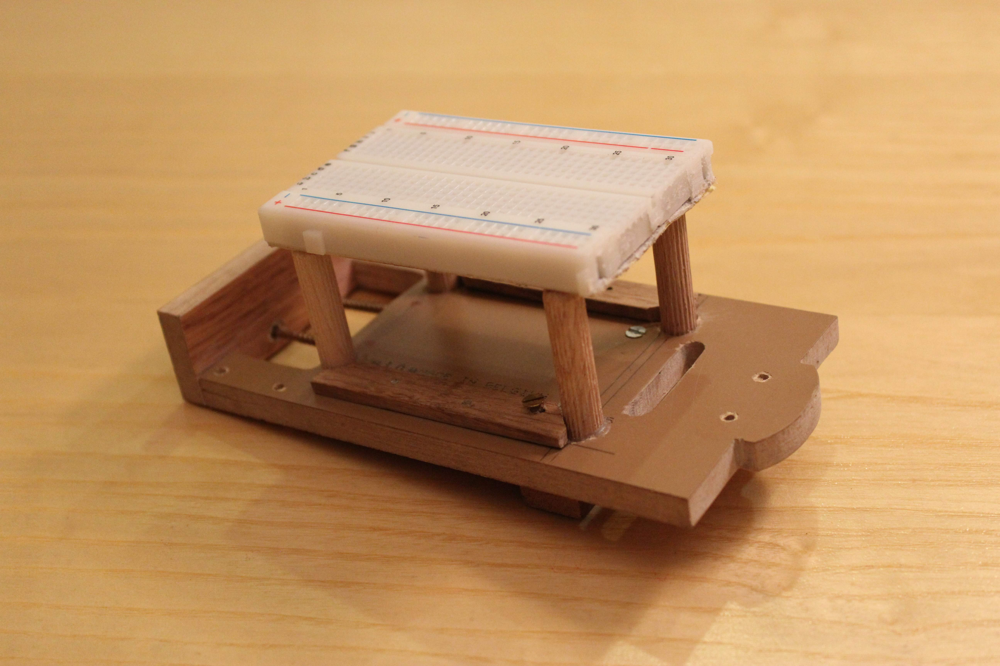

3. The H-bridge is screwed on the chassis.

    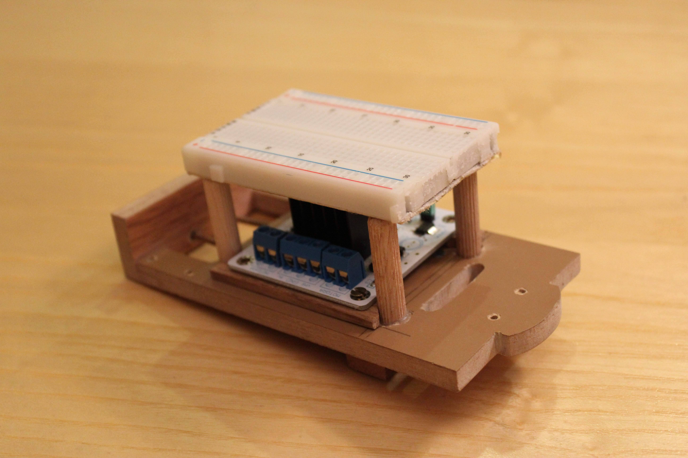

4. Solder encoders to the motors and header pins to the sensors.

    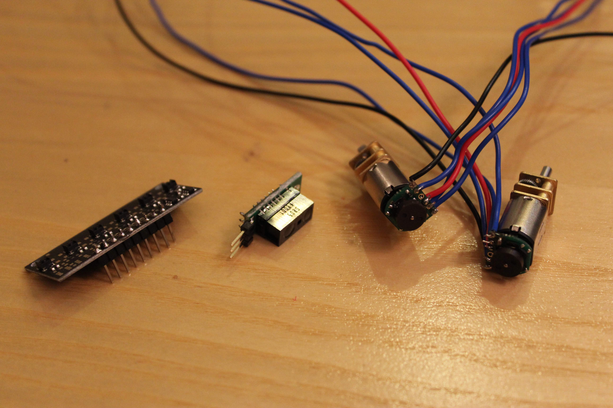

5. The micro-controller is soldered into header pins which are then fixed in the breadboard. The motors are fixed on the bottom of the 
chassis and the wheels are placed on the motor shafts.

    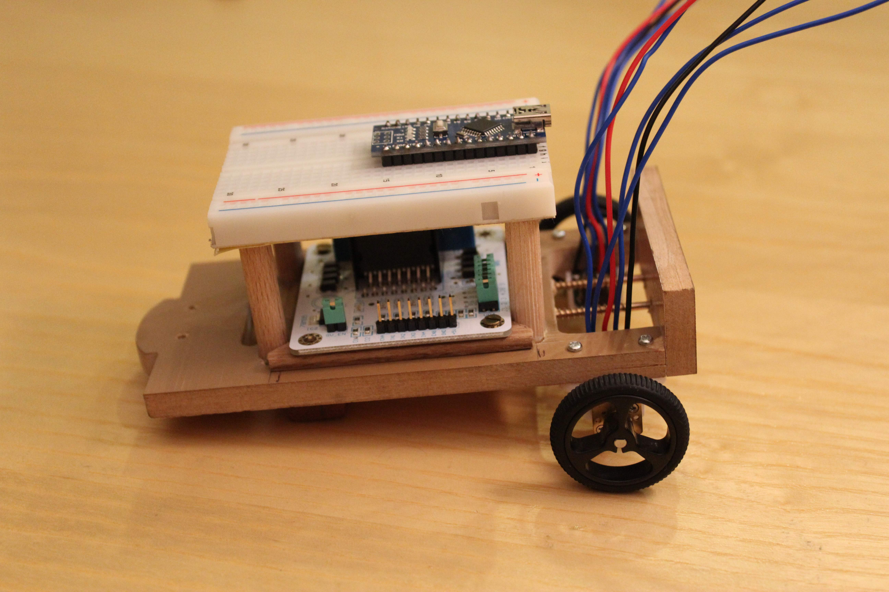

6. The omni-wheel is placed under the chassis, at the front.

    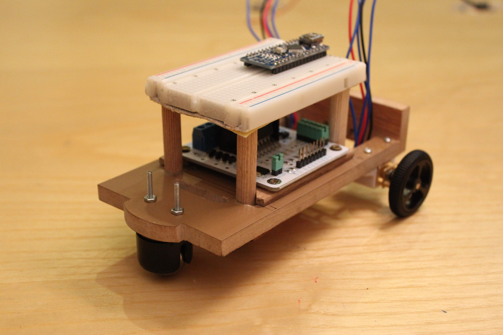

7. The QTRsensor along with its shields are fixed under the chassis.

    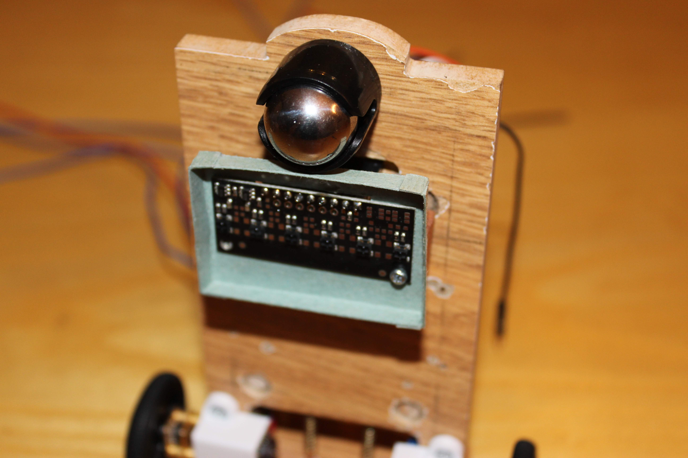

8. Wiring all the components as [here](../diagrams/electric.pdf).

    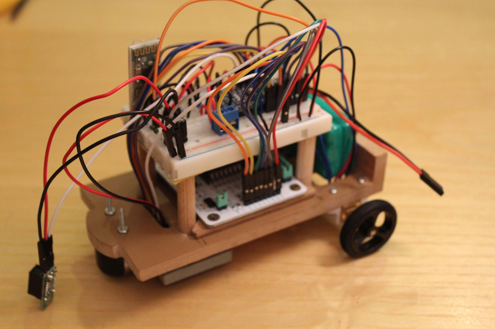

9. Solder swith.

    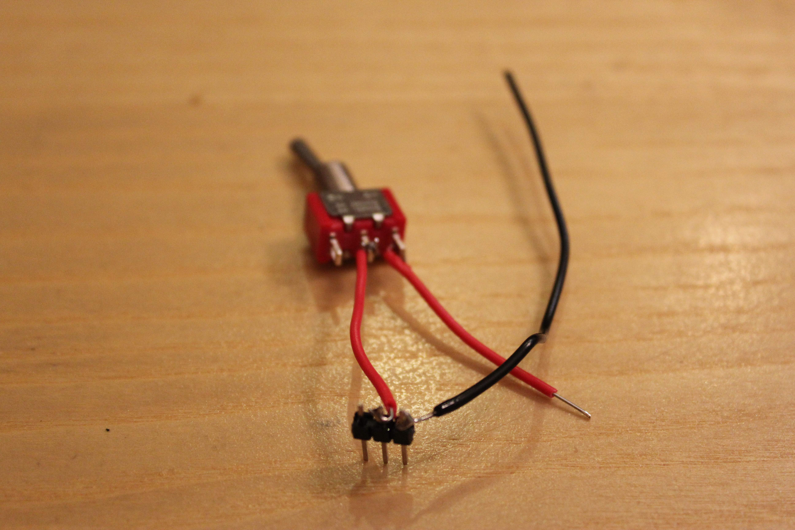

10. Connect the components to the power via the soldered switch. Paste the Sharp sensor on the chassis.

    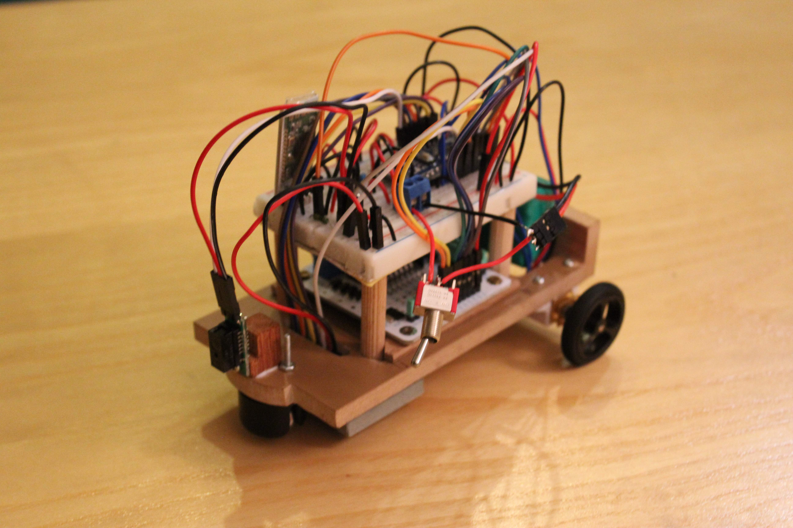

11. Make a second robot following the same steps.

    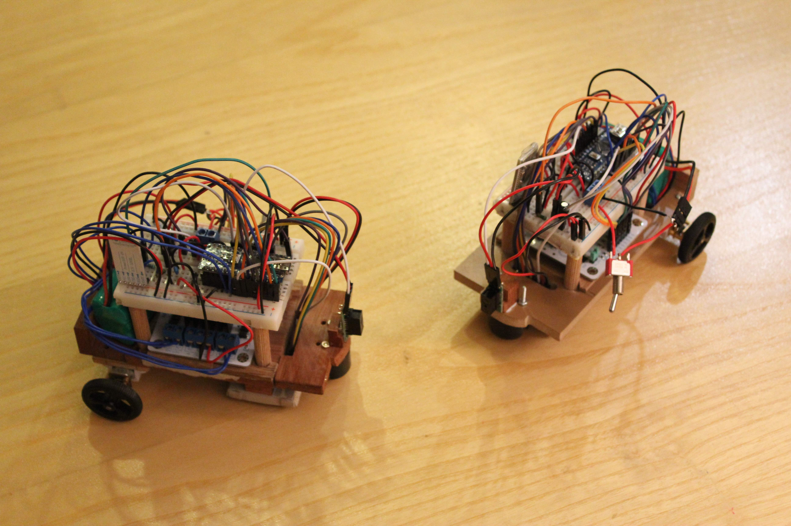

